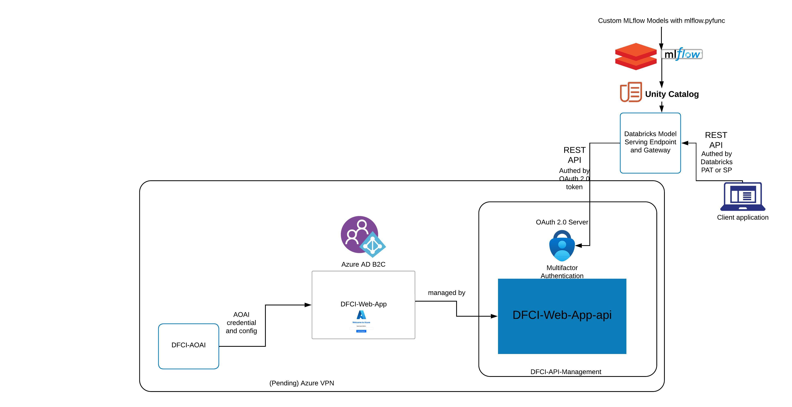

# DFCI's AOAI Azure App Service behind APIM, Deploy a Python (Flask) web app to Azure App Service, Custom PyFunc Python Model served by Databricks Model Serving

## Architecture here:

## Described in words, the architecture is:
notebook calling (client side) -> Databricks model serving endpoint with AI gateway, serving a custom pyfunc logged model in UC -> model first calling Azure OAuth2.0 server and get authed/issued with a token -> model then calling REST API managed by APIM -> Azure App Service -> AOAI model.
